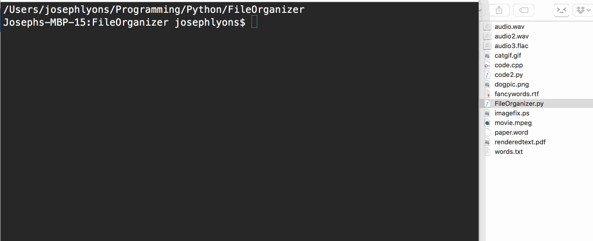

# FileOrganizer
A Python script that generates folders based on the extension names of the files
in the current working directory, then sorts all files into these folders.

# FileOrganizer in Action:

# Rules:
- If a valid directory is specified as the second argument when running the
script, it is used
- If there is no second argument supplied, the script runs in the current
directory
- Ignore all directories; do nothing to them
- Ignore all hidden files
- Ignore this Python script (if it resides in the folder being organized)
- Generate directory names left based on the extensions of the files
- Move all files into their associated directory
- If a file has no extension, move it into "MISC" folder

# Notes:
Because the script skips directories, if you have a directory that pretends to
be a simple file, it won't be moved.  This happens with applications that hide
information inside a directory pretending to be a file, for example:
`.xcodeproj`.  While this file will open up Xcode, it is actually a directory.

# TODO
- Update .gif
